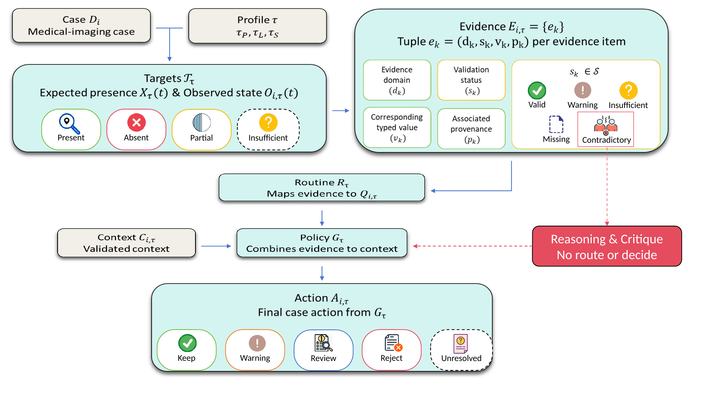

# AgentQC

AgentQC is a task-aware, artifact-grounded framework for medical-imaging dataset quality control (QC). It evaluates whether dataset resources are suitable for a specified downstream task and records durable, provenance-aware artifacts for evidence, routing, policy decisions, and internal audit.

## Overview

AgentQC is built around one principle: dataset reliability depends on the intended task. The same image, mask, or metadata issue may have different curation implications for visible-pancreas segmentation, lesion segmentation, or lesion-subregion analysis.

The authority path is deterministic:

```text
QC evidence -> task-specific requirements -> routing / policy -> final curation action
```

Deterministic and calibrated evidence, deterministic routing, and explicit policy/final-action logic are the only sources of final curation actions. `ReasoningAgent`, `MedicalCriticAgent`, optional LLM explanation artifacts, and interactive tools are advisory or explanatory only; they do not control routing, thresholds, policy, or final actions.

## Architecture

The pipeline records a validated run context, validates dataset resources, summarizes per-case imaging and annotation properties, computes deterministic and calibrated QC evidence, compares evidence, produces nonbinding reasoning and critique artifacts, routes uncertain cases, applies deterministic final policy, and performs post-hoc internal evaluation.



Key implementation areas:

- `agents/`: workflow agents and deterministic policy/routing components.
- `artifacts/`: typed artifact schemas, validation, hashing, and loading utilities.
- `configs/`: task profiles, thresholds, path examples, and LLM configuration.
- `scripts/`: public command-line entry points.
- `reproducibility/`: scripts and validated derived artifacts for reproducing current paper/poster analyses.

## Installation

```bash
git clone https://github.com/Andrade-Miranda/QC_System.git
cd QC_System
python -m venv .venv
source .venv/bin/activate
python -m pip install --upgrade pip
python -m pip install -r requirements.txt
```

The core analyses and reproduction scripts are CPU-compatible. Real-data QC uses medical-imaging files and requires dataset access; the public repository does not distribute raw medical data.

See `docs/installation.md` for details.

## Data preparation

AgentQC expects a local dataset root configured through `configs/paths.local.yaml` or the `AGENTQC_RAW_DATASET_ROOT` environment variable. A typical layout is:

```text
data/
  imagesTr/
    CASE_ID_0000.nii.gz
  labelsTr/
    CASE_ID/
      segmentations/
        pancreas.nii.gz
        pancreatic_lesion.nii.gz
        pancreas_head.nii.gz
        pancreas_body.nii.gz
        pancreas_tail.nii.gz
  metadata.xlsx
```

Do not commit raw medical images, masks, private metadata, or workstation-specific paths. See `docs/data_setup.md`.

## Quick start

Validate configuration:

```bash
python scripts/validate_config.py --task-mode pancreas_only
```

Run the canonical pipeline after configuring data paths:

```bash
python scripts/run_qc.py --task-mode pancreas_only --run-id example_run --overwrite
```

Run paper/poster reproduction checks from included validated derived artifacts:

```bash
python reproducibility/run_all.py
```

Run lightweight tests:

```bash
python -m unittest discover -s tests
```

## Outputs

Run outputs are written under:

```text
outputs/DATASET/TASK_MODE/runs/RUN_ID/
```

Important artifacts include validated run context, dataset validation, summaries, deterministic and calibrated QC reports, QC comparison, reasoning artifact, medical critique, review routing, final decisions, evaluation report, and run manifest. Reasoning, critique, and LLM explanation outputs are nonbinding and are not policy inputs. See `docs/outputs.md` and `docs/OUTPUT_STRUCTURE.md`.

## Reproducing the paper and poster

The current public reproduction layer uses validated derived artifacts, not private raw medical data. It verifies decision stability, stable-vs-task-changing evidence-domain prevalence, representative traces, reasoning/critic audit counts, and poster result figures.

See `reproducibility/README.md`.

## Citation

If you use AgentQC, cite the manuscript:

```bibtex
@misc{andrade2026agentqc,
  author = {Andrade, Gustavo},
  title = {AgentQC: Policy-Constrained Agentic Assessment of Task-Aware Reliability in Medical Imaging Datasets},
  year = {2026},
  note = {Manuscript},
  url = {https://github.com/Andrade-Miranda/QC_System}
}
```

No DOI is claimed in this repository unless one is added after formal publication.

## Limitations

The current evaluation demonstrates internal consistency, task-aware behavior, artifact/policy traceability, and architectural non-interference for the validated experiment artifacts. It does not establish independent clinical correctness, expert agreement, clinical ground truth, downstream model improvement, per-case clinical utility, or causal effects of evidence domains on action changes.
